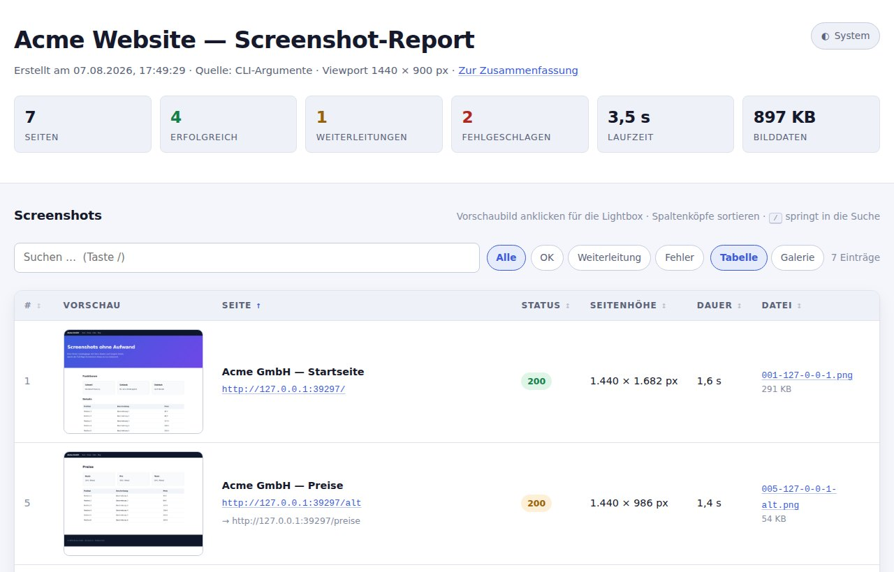
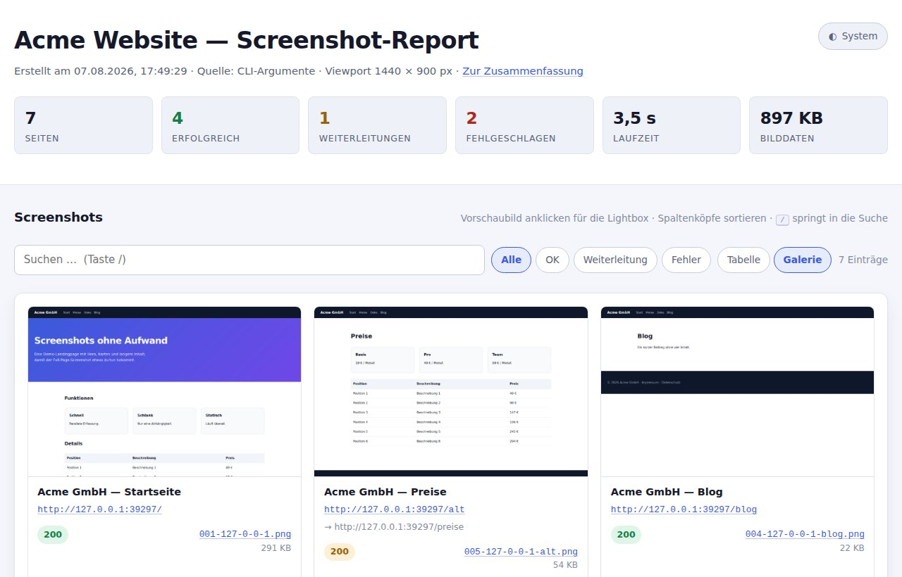
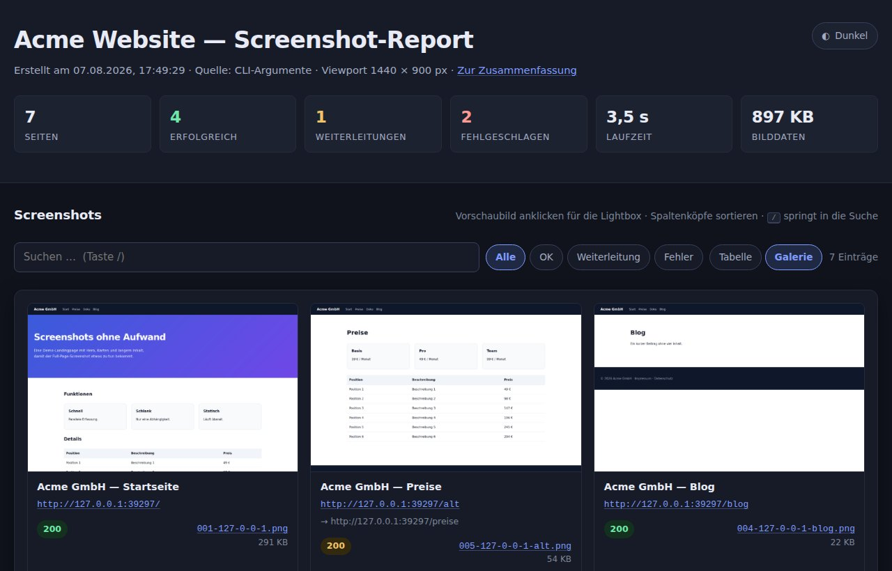

<div align="center">

# 📸 screenshotter

**Full-Page-Screenshots für eine Liste von URLs — plus fertigem HTML-Report.**

URLs eintragen, starten, fertig: jede Seite in voller Scrollhöhe als Bild,
dazu eine durchsuchbare Galerie, die auf jedem Webserver läuft.

[](https://nodejs.org)
[](https://playwright.dev)
[](package.json)
[](lib/assets)
[](#windows-einfach-doppelklicken)
[](#lizenz)



</div>

---

## Warum

Wer eine Website abnimmt, umzieht oder relauncht, braucht **Bestandsaufnahmen**:
wie sah jede Seite an diesem Tag aus? Von Hand sind das Dutzende Screenshots,
die niemand sortiert wiederfindet.

`screenshotter` erledigt das in einem Rutsch — und legt eine `index.html`
daneben, die man einfach auf den Webserver kopiert oder als Link verschickt.

* 🪶 **Genau eine Abhängigkeit** — [Playwright](https://playwright.dev) für Chromium. Sonst nur Node-Bordmittel.
* 🧱 **Kein Framework, kein Build** — der Report ist handgeschriebenes HTML, CSS und JavaScript.
* 🗃️ **Keine Datenbank** — alles liegt flach im Dateisystem.
* 🌍 **Läuft überall** — Apache/LAMP, nginx, GitHub Pages, S3 oder per Doppelklick über `file://`.
* ♿ **Auch ohne JavaScript** — beide Tabellen stehen komplett im HTML; JS ergänzt nur den Komfort.

---

## In 60 Sekunden

```bash
git clone https://github.com/daimpad/screenshotter.git
cd screenshotter
npm install                      # Chromium holt sich das Tool beim ersten Lauf selbst

node screenshotter.js --init     # urls.txt anlegen
#  ... URLs eintragen ...
node screenshotter.js --open     # loslegen und den Report öffnen
```

So sieht der Lauf aus:

```text
  screenshotter v1.1.0

  7 URL(s) aus urls.txt · Desktop 1440×900 · Full-Page · 3 parallel · Ziel .

  ✓ 200    1,6 s  https://example.com
  ✓ 200    1,4 s  https://example.com/preise
  ↻ 200    1,3 s  https://example.com/alt
  ✗ ---    95 ms  https://gibtsnicht.example
      Domain nicht gefunden
      → Schreibweise der URL prüfen. Existiert die Domain und ist DNS erreichbar?

  ████████████░░░░░░░░  5/7 · 1 Fehler · noch ~3 s
```

> **Windows?** Dann brauchst du gar keine Kommandozeile —
> [`screenshotter.cmd` doppelklicken](#windows-einfach-doppelklicken).

---

## Der Report

Zwei Ansichten auf denselben Daten, umschaltbar in der Werkzeugleiste:

| Galerie | Dunkel |
|---|---|
|  |  |

**Oben** Kennzahlen: Seiten, erfolgreich, weitergeleitet, fehlgeschlagen, Laufzeit, Bilddaten.
**In der Mitte** alle Screenshots, alphabetisch nach URL vorsortiert.
**Am Ende** die Zusammenfassung mit URL, Statuscode, Zeitstempel und Dateiname.

| Aktion | Wie |
|---|---|
| Bild vergrößern | Vorschaubild anklicken → Lightbox |
| Blättern | <kbd>←</kbd> <kbd>→</kbd> oder die Pfeil-Buttons |
| Originalgröße | Im Vollbild auf das Bild klicken |
| Schließen | <kbd>Esc</kbd>, das ✕ oder Klick auf den Hintergrund |
| Suchen | <kbd>/</kbd> springt ins Suchfeld, <kbd>Esc</kbd> leert es |
| Sortieren | Spaltenkopf anklicken (nochmal = umgekehrt) |
| Filtern | *Alle · OK · Weiterleitung · Fehler* |
| Ansicht | *Tabelle* oder *Galerie* — die Wahl wird gemerkt |
| Hell/Dunkel | Schalter oben rechts, folgt sonst dem System |

Unter 1000 px Breite werden beide Tabellen automatisch zu Karten — ohne
horizontales Scrollen.

---

## Was dabei herauskommt

```text
index.html                    ← der Report
report.json                   ← dieselben Daten maschinenlesbar
assets/
  report.css                  ← Vanilla CSS
  report.js                   ← Vanilla JS (Sortierung, Filter, Lightbox)
screenshots/
  001-example-com.png         ← Full-Page-Screenshot
  002-example-com-preise.png
  thumbs/
    001-example-com.png       ← Vorschaubild für die Tabelle
    002-example-com-preise.png
```

Dateinamen entstehen aus Laufnummer und URL — stabil, eindeutig und
alphabetisch sortierbar.

---

## Windows: einfach doppelklicken

**`screenshotter.cmd`** doppelklicken, mehr braucht es nicht.

Der Starter prüft Node.js, installiert beim ersten Mal die Abhängigkeiten und
den Browser, fragt dann kurz nach:

```text
  In urls.txt stehen aktuell 3 URL(s).

    [1]  Screenshots jetzt erstellen
    [2]  urls.txt bearbeiten
    [3]  Beenden

    Auswahl:
```

Danach öffnet sich der fertige Report im Browser. Ab dem zweiten Start sind es
nur noch Doppelklick, <kbd>1</kbd>, fertig.

**Node.js** ist die einzige Software, die von Hand installiert werden muss —
die [LTS-Version](https://nodejs.org/de/download) mit Standardeinstellungen genügt.
Fehlt sie, bietet der Starter die Downloadseite an.

<details>
<summary><b>Tipps und Stolpersteine unter Windows</b></summary>

<br>

**Verknüpfung auf dem Desktop:** Rechtsklick auf `screenshotter.cmd` →
*Verknüpfung erstellen* → auf den Desktop ziehen.

**„Der Computer wurde durch Windows geschützt“:** Als ZIP heruntergeladene
Dateien markiert Windows als „aus dem Internet“. Rechtsklick auf
`screenshotter.cmd` → *Eigenschaften* → *Zulassen* → *OK*. Nach `git clone`
passiert das nicht.

**Das Fenster blinkt kurz auf und schließt sich:** Bei Fehlern hält der Starter
selbst an. Passiert es trotzdem, den Ablauf direkt ansehen: Explorer öffnen, in
die Adressleiste `cmd` tippen, Enter, dann `screenshotter.cmd` eingeben.

**`'node' ist nicht als interner oder externer Befehl erkannt`:** Node ist
installiert, aber der Suchpfad noch nicht aktualisiert — einmal ab- und
wieder anmelden.

</details>

---

## Eingabe: woher die URLs kommen

Drei Quellen, in dieser Reihenfolge:

**1. Direkt auf der Kommandozeile** — hat Vorrang, `urls.txt` wird dann nicht zusätzlich gelesen:

```bash
node screenshotter.js https://example.com example.org "https://example.net | Netzseite"
```

**2. Eine Textdatei** (Standard `urls.txt`, anders wählbar mit `--input`):

```text
# Kommentarzeilen beginnen mit "#" oder "//".

https://example.com                 | Startseite
https://example.com/preise          | Preisübersicht
example.com/kontakt

# Ein "#" mitten in der URL bleibt ein Fragment:
https://example.com/docs#installation
```

* Eine URL pro Zeile, fehlendes `https://` wird ergänzt.
* Nach `|` darf ein **Label** stehen — es erscheint im Report und ist mitdurchsuchbar.
* Doppelte URLs werden übersprungen, ungültige melden ihre Zeilennummer.
* Erlaubt sind nur `http` und `https`.

**3. stdin:**

```bash
grep -h '^https' sitemap-*.txt | node screenshotter.js --out public
```

---

## Optionen

Die acht, die man wirklich braucht:

| Option | Wirkung |
|---|---|
| `-p, --preset <gerät>` | `desktop` · `laptop` · `tablet` · `mobile` |
| `--open` | Report nach dem Lauf im Browser öffnen |
| `-o, --out <ordner>` | Zielordner (Standard: aktuelles Verzeichnis) |
| `-i, --input <datei>` | Andere Eingabeliste |
| `-c, --concurrency <n>` | Parallele Seiten (Standard: 3) |
| `-f, --format <png\|jpeg>` | `jpeg` spart deutlich Platz |
| `--hide <selektoren>` | Cookie-Banner und Werbung ausblenden |
| `--init` | `urls.txt`-Vorlage anlegen |

### Geräteprofile

| Profil | Viewport | Skalierung | Mobil-Emulation |
|---|---|---|---|
| `desktop` | 1440 × 900 | 1× | – |
| `laptop` | 1280 × 800 | 1× | – |
| `tablet` | 820 × 1180 | 2× | ✓ |
| `mobile` | 390 × 844 | 2× | ✓ |

Einzelne `--width` / `--height` / `--scale` überschreiben das Profil.
Bei `tablet` und `mobile` schaltet Chromium in die Mobil-Emulation — Seiten
**ohne** `<meta name="viewport">` rendert es dann mit 980 CSS-Pixeln Breite und
skaliert sie herunter, genau wie ein echtes Smartphone.

<details>
<summary><b>Alle weiteren Optionen</b></summary>

<br>

| Option | Standard | Bedeutung |
|---|---|---|
| `--shots-dir <name>` | `screenshots` | Unterordner für die Bilder |
| `-w, --width <px>` | `1440` | Viewport-Breite = Screenshot-Breite |
| `--height <px>` | `900` | Viewport-Höhe (bei Full-Page die Mindesthöhe) |
| `--scale <n>` | `1` | `deviceScaleFactor`, `2` = Retina |
| `--quality <1-100>` | `80` | nur mit `--format jpeg` |
| `-t, --timeout <ms>` | `30000` | Timeout pro Seite |
| `--wait-until <state>` | `load` | `load` · `domcontentloaded` · `networkidle` · `commit` |
| `--delay <ms>` | `500` | Wartezeit direkt vor dem Auslösen |
| `--retries <n>` | `1` | Wiederholungen pro URL |
| `--thumb-width <px>` | `480` | Breite der Vorschaubilder |
| `--thumb-height <px>` | `360` | Höhe der Vorschaubilder (oberer Ausschnitt) |
| `--user-agent <ua>` | – | Eigener User-Agent |
| `--color-scheme <s>` | – | `light` · `dark` · `no-preference` erzwingen |
| `--proxy <server>` | `$HTTPS_PROXY` | Proxy für den Browser |
| `--title <text>` | `Screenshot-Report` | Überschrift und `<title>` |
| `--browser-path <pfad>` | – | Eigene Chromium-Binary |
| `--no-full-page` | – | Nur den sichtbaren Viewport |
| `--no-scroll` | – | Kein Vorab-Scrollen (Lazy-Loading nicht auslösen) |
| `--no-stabilize` | – | Animationen **nicht** abschalten |
| `--no-thumbnails` | – | Keine Vorschaubilder |
| `--no-report` | – | Nur Screenshots, kein `index.html` |
| `--no-sandbox` | – | Chromium ohne Sandbox (Docker, CI als root) |
| `--no-proxy` | – | Proxy aus der Umgebung ignorieren |
| `--allow-failures` | – | Exit-Code 0 trotz Fehlern |
| `-q, --quiet` | – | Nur Fehler ausgeben |

`node screenshotter.js --help` zeigt dieselbe Liste im Terminal.

</details>

### Was für saubere Screenshots automatisch passiert

1. **Animationen einfrieren** — CSS-Animationen und -Transitions auf Dauer 0, Text-Cursor unsichtbar.
2. **Durchscrollen** — die Seite wird in Schritten bis ans Ende gescrollt, damit `loading="lazy"`-Bilder und IntersectionObserver-Inhalte wirklich laden, danach zurück nach oben.
3. **Ruhe abwarten** — `networkidle` (bis 5 s), `document.fonts.ready`, dann `--delay`.
4. **Erst dann** wird über die volle Dokumenthöhe ausgelöst.

Abschaltbar mit `--no-stabilize` und `--no-scroll`.

---

## Rezepte

```bash
# Wie sieht die Seite auf dem Handy aus?
node screenshotter.js --preset mobile --open

# Große Listen: mehr Parallelität, kleinere Dateien
node screenshotter.js -c 8 --format jpeg --quality 75

# Cookie-Banner und Werbung wegblenden
node screenshotter.js --hide "#cookie-banner,.cmp-overlay" --hide ".ad-slot"

# Träge Seiten
node screenshotter.js --wait-until networkidle --delay 3000 --timeout 60000 --retries 3

# Dark-Mode-Variante der Seiten in einen eigenen Ordner
node screenshotter.js -o report-dark --color-scheme dark --title "Report (Dark Mode)"

# Desktop und Handy nebeneinander vergleichen
node screenshotter.js -p desktop -o vergleich/desktop
node screenshotter.js -p mobile  -o vergleich/mobile
```

---

## Veröffentlichen

Der Zielordner ist bereits eine fertige statische Website — kein PHP, kein Node,
keine Datenbank auf dem Server.

<details>
<summary><b>Apache / LAMP</b></summary>

<br>

```bash
node screenshotter.js --out build --title "Kundenprojekt — Screenshots"
rsync -av --delete build/ user@server:/var/www/html/screenshots/
```

Aufruf unter `https://server/screenshots/`. `index.html` wird automatisch als
Verzeichnisindex ausgeliefert, eine `.htaccess` ist nicht nötig.

</details>

<details>
<summary><b>nginx</b></summary>

<br>

```nginx
server {
    listen 80;
    server_name screenshots.example.com;
    root /var/www/screenshots;
    index index.html;
}
```

</details>

<details>
<summary><b>GitHub Pages</b></summary>

<br>

Dieses Repository enthält bereits den Workflow
[`.github/workflows/static.yml`](.github/workflows/static.yml), der das gesamte
Repository nach jedem Push auf `main` veröffentlicht:

```bash
node screenshotter.js
git add index.html report.json assets screenshots
git commit -m "Screenshot-Report aktualisiert"
git push
```

Screenshots sind Binärdateien — wer sie regelmäßig eincheckt, sollte die Historie
im Blick behalten oder in `.gitignore` die vorbereiteten Zeilen aktivieren und
stattdessen per rsync deployen.

</details>

<details>
<summary><b>Nur lokal ansehen</b></summary>

<br>

`index.html` funktioniert per Doppelklick über `file://`. Wer lieber einen
Server möchte:

```bash
npx serve .            # oder:
python3 -m http.server 8080
```

</details>

---

## Automatisieren

**Täglich per cron:**

```cron
30 3 * * * cd /opt/screenshotter && /usr/bin/node screenshotter.js --quiet --allow-failures --out /var/www/html/screenshots
```

**In einer CI-Pipeline:**

```yaml
- uses: actions/setup-node@v4
  with: { node-version: '22' }
- run: npm ci
- run: npx playwright install --with-deps chromium
- run: node screenshotter.js --input urls.txt --out public --allow-failures
- uses: actions/upload-artifact@v4
  with: { name: screenshot-report, path: public }
```

Ohne `--allow-failures` bricht der Schritt ab, sobald eine URL fehlschlägt —
genau das, was man für einen Erreichbarkeits-Check will.

### report.json

Dieselben Daten maschinenlesbar, praktisch für Diffs und Monitoring:

```bash
# Alle fehlgeschlagenen URLs auflisten
node -e "console.log(require('./report.json').results.filter(r=>r.state==='error').map(r=>r.url).join('\n'))"
```

<details>
<summary><b>Struktur von report.json</b></summary>

<br>

```json
{
  "generator": "screenshotter v1.1.0",
  "generatedAt": "2026-08-07T15:19:44.512Z",
  "source": "urls.txt",
  "options": { "preset": "desktop", "width": 1440, "height": 900, "scale": 1, "fullPage": true, "…": "…" },
  "stats": { "total": 7, "ok": 4, "redirect": 1, "error": 2, "bytes": 918273, "durationMs": 3412 },
  "results": [
    {
      "index": 0,
      "url": "https://example.com/",
      "label": "Startseite",
      "file": "screenshots/001-example-com.png",
      "thumb": "screenshots/thumbs/001-example-com.png",
      "fileName": "001-example-com.png",
      "status": 200,
      "statusText": "OK",
      "state": "ok",
      "title": "Example Domain",
      "finalUrl": "https://example.com/",
      "timestamp": "2026-08-07T15:19:40.881Z",
      "durationMs": 1613,
      "bytes": 298122,
      "pageWidth": 1440,
      "pageHeight": 1682,
      "attempts": 1,
      "error": null,
      "errorHint": "",
      "errorCode": "",
      "errorRaw": ""
    }
  ]
}
```

Bei einem Fehler sind `file` und `thumb` `null`, `error` enthält den Klartext,
`errorHint` den Lösungsvorschlag und `errorRaw` die Originalmeldung von Chromium.
Die Proxy-Einstellung wird bewusst **nicht** mitgeschrieben.

</details>

---

## Fehlerbehebung

Die meisten Fehler erklären sich inzwischen selbst — das Tool übersetzt
Chromium-Meldungen in Klartext und schlägt gleich eine Lösung vor:

```text
  ✗ ---   0,3 s  https://beispiel.example
      Zeitüberschreitung nach 30 s
      → Seite braucht länger: --timeout 60000 setzen, notfalls zusätzlich --wait-until domcontentloaded.
```

<details>
<summary><b>Weitere Fälle</b></summary>

<br>

**`Chromium konnte nicht gestartet werden`**
Normalerweise lädt das Tool den Browser beim ersten Lauf selbst nach. Klappt das
nicht: `npx playwright install chromium`, auf Servern zusätzlich
`--with-deps`. Ein vorhandenes Chromium nutzt man mit
`--browser-path /usr/bin/chromium` oder der Umgebungsvariable
`SCREENSHOTTER_CHROMIUM`. Mit `PLAYWRIGHT_SKIP_BROWSER_DOWNLOAD=1` unterbleibt
der automatische Download.

**In Docker oder als root bricht der Start ab**
`--no-sandbox` verwenden.

**Ein Cookie-Banner verdeckt die Seite**
`--hide "#cookie-banner,.cmp"` — die Selektoren werden per CSS auf
`visibility: hidden` gesetzt.

**Untere Seitenteile sind leer**
Lazy-Loading braucht mehr Zeit: `--wait-until networkidle --delay 2000`.
Prüfen, dass `--no-scroll` **nicht** gesetzt ist.

**Die Seite scrollt endlos und der Screenshot wird riesig**
`--no-scroll` benutzen oder mit `--no-full-page` nur den Viewport aufnehmen.
Das Vorab-Scrollen bricht ohnehin nach 10 Sekunden ab.

**Viele Seiten laufen in Timeouts**
Parallelität senken (`-c 2`), damit sich die Seiten nicht gegenseitig ausbremsen.

**Sticky-Header tauchen im Bild mehrfach auf**
Den Header für die Aufnahme ausblenden: `--hide "header.sticky"`.

**Die Screenshots sind sehr groß**
`--format jpeg --quality 75` reduziert die Dateigröße drastisch.

**Auf dem Server fehlen Schriften oder Emojis**
Nachinstallieren, z.B. `apt install fonts-liberation fonts-noto-color-emoji`.

**Der Report zeigt keine Bilder**
`index.html`, `assets/` und `screenshots/` gehören in denselben Ordner — die
Pfade im Report sind relativ.

</details>

### Exit-Codes

| Code | Bedeutung |
|---|---|
| `0` | Alles erfolgreich (oder `--allow-failures`) |
| `1` | Mindestens eine URL fehlgeschlagen (Netzwerkfehler oder Status ≥ 400) |
| `2` | Bedienfehler: unbekannte Option, ungültiger Wert, fehlende Datei, Browser startet nicht |

---

## Entwicklung

```bash
npm test           # alles (48 Tests)
npm run test:unit  # nur Unit-Tests, ohne Browser
npm run test:e2e   # kompletter Lauf gegen einen lokalen Testserver
```

Die E2E-Tests starten einen kleinen HTTP-Server mit vorbereiteten Seiten (lang,
kurz, Weiterleitung, 404, ohne Viewport-Meta, Sonderzeichen im Titel, toter
Port), lassen das CLI darüber laufen und prüfen danach Bildmaße, Statuslogik,
HTML-Escaping sowie Sortierung, Filter, Lightbox, Galerie-Ansicht und
Kartenlayout im echten Chromium.

```text
screenshotter.cmd         Starter für Windows (Doppelklick)
screenshotter.js          Einstiegspunkt: Ablauf, Konsolenausgabe, Exit-Code
lib/
  cli.js                  Optionen, Geräteprofile, Validierung, Hilfetext
  urls.js                 Einlesen und Normalisieren der URL-Liste
  capture.js              Browserstart, Screenshots, Thumbnails, Parallelität
  report.js               Erzeugung von index.html und report.json
  diagnose.js             Chromium-Fehler → Klartext plus Lösungshinweis
  progress.js             Terminal-Ausgabe, Farben, Fortschrittsbalken
  open.js                 Datei im Standardprogramm öffnen
  errors.js               Fehlertyp für Bedienfehler
  assets/
    report.css            Stylesheet des Reports (wird nach assets/ kopiert)
    report.js             Interaktionen des Reports (wird nach assets/ kopiert)
test/
  units.test.js           Unit-Tests
  e2e.test.js             End-to-End-Tests
  fixtures/server.js      Testserver und PNG-Hilfsfunktionen
```

Die Vorschaubilder entstehen ohne Bildbibliothek: das fertige PNG wird in einer
viewportgroßen Seite dargestellt und erneut fotografiert. Das spart eine
Abhängigkeit wie `sharp` und liefert exakt die gewünschte Kachelgröße.

Weitere Hinweise für Beitragende — Architektur, Konventionen und die
Fallstricke, über die dieses Projekt schon gestolpert ist — stehen in
[`CLAUDE.md`](CLAUDE.md).

---

## Grenzen

* **Nur Chromium.** Firefox und WebKit wären eine Zeile Code, würden aber zwei weitere Browser-Downloads bedeuten.
* **Keine Logins.** Seiten werden so aufgenommen, wie ein anonymer Besucher sie sieht.
* **Sehr hohe Seiten** (mehr als ca. 30.000 px) kann Chromium abschneiden — dann `--no-full-page` oder eine kleinere `--scale`.
* **Kein Bildvergleich.** Das Werkzeug erstellt Bestandsaufnahmen, es diffed sie nicht.

---

## Lizenz

MIT
